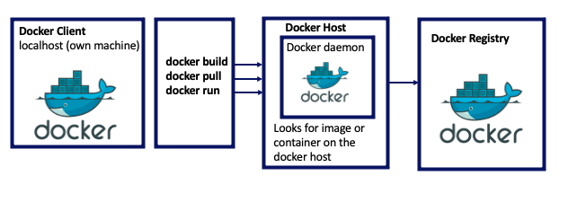
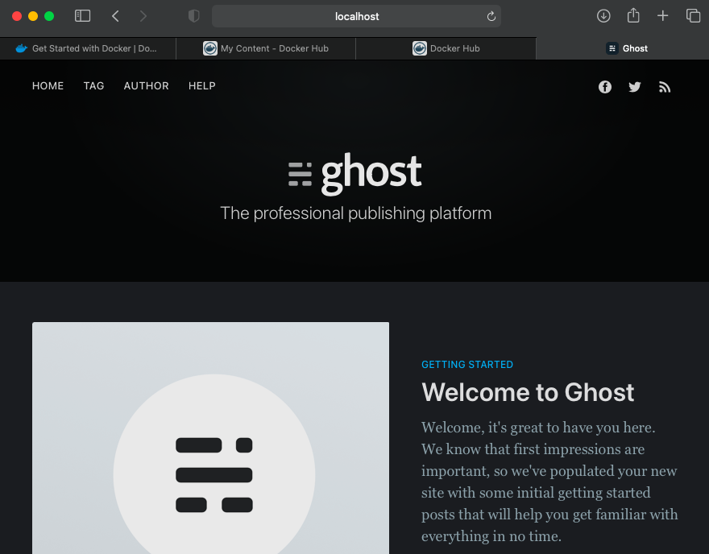
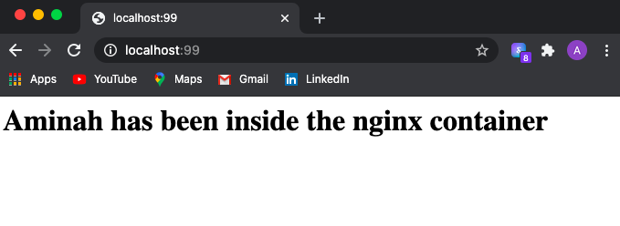

# Containerisation with Docker

## What is Docker?
* Docker is an open-source platform used for containerisation.
* It enables us to separate applications from the infrastructure.
* It allows us to deliver software faster
* Docker is written in GO language.

### Why Docker?
* Multi-billion dollar companies are using or adopting Docker including eBay, Netflix, and Sky.


### Demand and future of Docker
* Docker adoption is anticipated by 50% by the end of 2020.

## What is a Container?
* A standardised unit of software.
* Packages code and all its dependencies so applications can run quickly and reliably from one environment to another.
* Container images are lightweight, standalone, executable packages of software.
* They include everything needed to run an app (code, runtime, system tools, libraries, settings).      
.      
* Images become containers when they run on Docker Engine.
* Such containers are:
  * Standard - Portable anywhere
  * Lightweight - share machine OS therefore do no need their own OS. This lead to higher efficiency and reduced server and license costs.
  * Secure - 'Docker provides the strongest default isolation capabilities in the industry' [*source*](https://www.docker.com/resources/what-container)

### What is the difference between VM and containers
* Docker is lightweight and user-friendly.
* Docker shares the resources of the OS as opposed to building a new OS.
* Docker engine connects the container with OS and only uses the resources required
* VM works with hypervisor to connect guest OS/VM with host OS.

## Docker Architecture


# Docker Setup and Installation
1. Download Docker Desktop for relevant OS.
2. While waiting for installtion, create an account on Docker Hub.
3. Login to Docker Hub and create a new repository.
4. Wait for Docker Desktop to finish installation and open the Desktop app.
4. Once installed, an icon should appear on the menu bar (top right).
5. Confirm installation by running the following commands in the terminal.
  * Pull the container, in this case, simple hello-world
  ```bash
  docker pull hello-world
  ```
  * Confirm the image has been pulled. Can also check via Docker desktop.
  ```bash
  docker images
  ```
  * Run the image. This should display a message notifying the installation was successful.
  ```bash
  docker run hello-world
  ```
## Docker commands
1. Pull an image
```bash
docker pull name_of_image
```
2. Run an image
```bash
docker run name_of_image
```
3. Build an image
```bash
docker build -t name_of_image
```
4. Commit image to a container
```bash
docker commit name_of_image/container_id
```
5. View docker images
```
docker images
```
6. Start a container
```
docker start container_id
```
7. Stop a container - Retains any data stored
```
docker stop container_id/name
```
8. Remove a container - Gets rid of any data stored in the container
```
docker rm container_id/name
```
9. Check running containers
```bash
docker ps
```

10. Check all existing containers and their status
```bash
docker ps -a
```
11. Logging into a container
```bash
docker exec -it name_of_container/id
```


### Running containers
* We run a container using the following syntax:
```
docker run -d -p 80:80 container_name
```
* -d and -p flags enable us to run in dissociated mode so we gain access to the terminal.
* Port mapping is as follows `localhost_port:container_port`

#### 1. Nginx
* Run the container using the following command
```
docker run -d -p 80:80 nginx
```
* We can stop the container.
```
docker stop 2e86da2806cd
```
* Upon stopping the container, if we navigate to localhost webpage, we should have a server timeout error.
#### 2. Ghost
* Run using
```
docker run -d -p 2368:2368 ghost
```
* Check whether the image has been created
```bash
docker images
```
* Check whether the container is running
```
docker ps
```
* Check the webpage is running by typing `localhost:2368` in a browser.    

* Stop and delete ghost container
```
docker stop ed3280431d6c
docker ps
docker rm ed3280431d6c
docker ps -a
```
* Reinstall the ghost container and confirm the webpage is showing
```
docker run -d -p 2368:2368 ghost
docker ps
```
```
localhost:2368
```
#### 3. Docker Documentation
* We can gain access to all of the docker documentation on our localhost by running the following container.
```bash
docker run -d -p 4000:4000 docs/docker.github.io
```
* NB: This will take some time to install due to the size of the container.
* We can view the documentation by typing `localhost:4000` in the search bar.

### Logging into containers
* Logging into the container allows us to change the configuration.
* Return back to the nginx container, if it is not started, start it.
* Log into the container using the following command.
```bash
docker exec -it 839c6c5a0a4c bash
```
* If we want to change the index html page, we can navigate to its location and change it. `nano` may need to be installed.
```
/usr/share/nginx/html
apt-get install nano
```
* If we refresh the webpage, changes we made to the file will be taken into effect.

#### Task - Copying in files
* We can replace the index.html file with our own file by copying it in to the nginx container.
* In order to copy files from the local host TO a container, the syntax is:
```
docker cp path/to/file.txt container_id:/path/to/location/on/host
```
* Thus, for this task, the following command was used:
```
docker cp ~/Containerisation/index.html 839c6c5a0a4c:/usr/share/nginx/html
```
* Upon navigating to the webadress `localhost:99`, the following page can be viewed.

