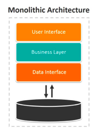
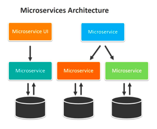

# Microservices

# Monolith Architecture

* Means 'composed all in one piece'
* Traditional approach to architecture
* single tiered software application i.e. various components combined into a single program.
* Example use case - e-commerce app (takes orders, checks inventory, authorise payments etc.)

| Benefits                                                                          | Drawbacks                                                                                            |
|-----------------------------------------------------------------------------------|------------------------------------------------------------------------------------------------------|
| Early development is simple                                                       | Maintenance- Large applications become increasingly complex. Can be a challenge to make fast changes  |
| Tests can be run easily                                                           | Large applications can lead to long start up times                                                   |
| Deployment only requires the app to be copied to a server                         | With each update, entire application must be redeployed.                                             |
| Horizontal scaling simply requires multiple copies running behind a load balancer | Can be difficult to scale with conflicting resource requirements.                                    |
|                                                                                   | Reliability - A bug can bring down entire architecture.                                              |
|                                                                                   | Difficulty in adopting new technologies as entire architecture affected and would need amending.     |

# Microservice Architecture?

* Architectural approach wherein services are split up into smaller nodes, called microservices.
* Services built around business capabilities so each microservice typically addresses one business capability.
* Split your application into smaller, inter-connected services that are:
  * Highly maintainable and testable
  * Loosely coupled
  * Independently deployable
  * Organsied around business capabilities
  * Owned by small teams

| Benefits                                                                                                               | Drawbacks                                                                                     |
|------------------------------------------------------------------------------------------------------------------------|-----------------------------------------------------------------------------------------------|
| Enable continuous delivery and deployment of complex applications.                                                     | Additional complexity in developing architecture                                              |
| Faster testing as services are smaller                                                                                 | Tools built for monolith applications may not support distributed applications.               |
| Independent deployment                                                                                                 | Testing is more difficult                                                                     |
| Team independence- each team is responsible for their own service(s) so they can develop, deploy, scale independently. | Crossovers in functionality can be difficult to deal with and required careful coordination.  |
| Relatively small                                                                                                       | Resource consumption - Use a lot more memory than monolith therefore higher costs.           |
| Easier for developers to understand                                                                                    | Deployment has added complexities.                                                            |
| Applications starts up faster                                                                                          |                                                                                               |
| Fault isolation - bugs will not affect the entire architecture.                                                        |                                                                                               |
| Can adopt new technologies with more ease than monolith architectures.                                                 |                                                                                               |

## Features of Microservice Architecture
1. Decoupling – Application easily built, altered, and scaled.
2. Componentization – Independent components that can be easily replaced and upgraded
3. Business Capabilities– Focus on a single capability
4. Autonomy – Developers and teams can work independently of each other, thus increasing speed
5. Continuous Delivery – Allows frequent releases of software.
6. Responsibility – Treat applications as products for which they are responsible.
7. Decentralised Governance – The focus is on using the right tool for the right job. Developers have the freedom to choose the best tools to solve their problems.
8. Agility – Support agile development - new feature can be quickly developed and discarded again

# When not to use Microservice?
* For small projects:
  * Require lots of resources to build and maintain.
  * Not cost-effective

# Kubernetes
* Open-source system for automating deployment, scaling, and management of containerised applications.
* Orchestration manager for containers
* Also known as K8
* Enables you to manage containers and their behaviour
* Creates pods  
* Benefits
  * Self-healing - if something goes wrong with a container, Kubernetes can spin up a new one.
  * Scale on demand
  * Auto scale
  * Assign individual IPs to containers
  * Use ingress rules to deal with web-facing interface.
