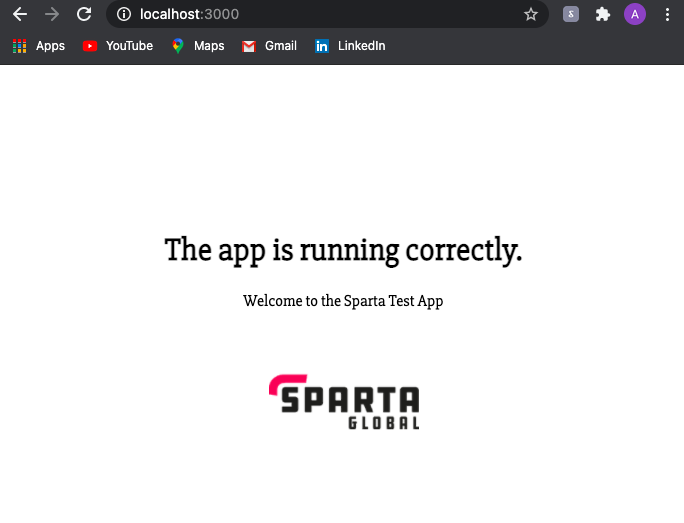

# Task - Containerise the nodejs app

## Steps:
1. Copy the relevant app files
2. Create a Dockerfile as shown

```
# Build this image from the offical node image
FROM node

# Label is used as a reference if you need to know who build the image
LABEL MAINTAINER= email_address

# Working directory set so we do not have to continually reference throughout
WORKDIR usr/src/app

# Copy app files into the container
COPY app/ .

# Install dependencies in the local node_modules folder
RUN npm install

# Expose port 3000
EXPOSE 3000

# Run the command `npm start app.js`
CMD [ "npm","start","app.js;" ]
```
3. Create a new repository on DockerHub

4. Build a new image using the command
```
docker build -t mina100216/eng74-nodejs-app-dockerised .
```
5. Run the container on port 3000
```
docker run -d -p 3000:3000 mina100216/eng74-nodejs-app-dockerised
```
6. Confirm the app is visible on localhost:3000.        

